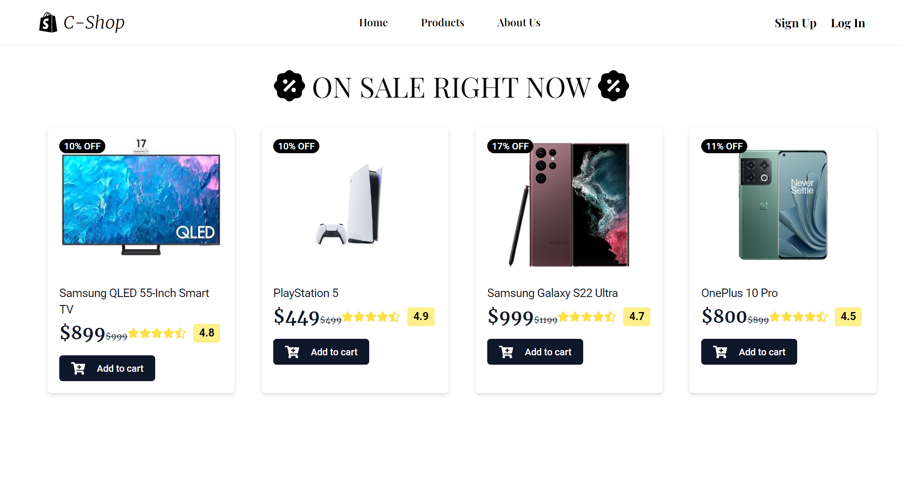
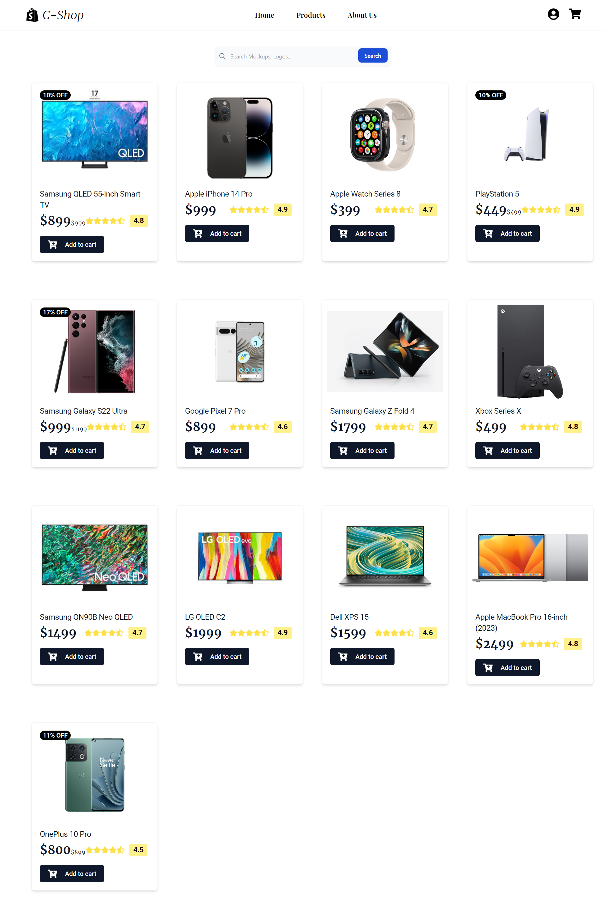
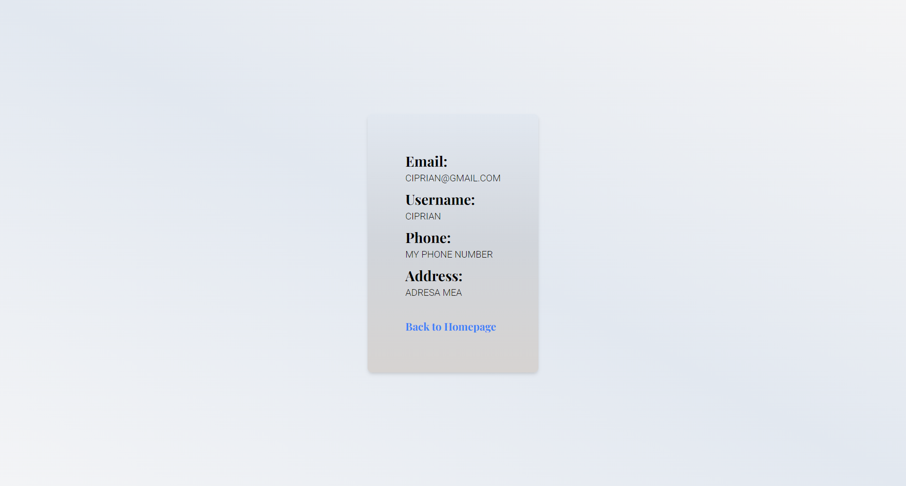
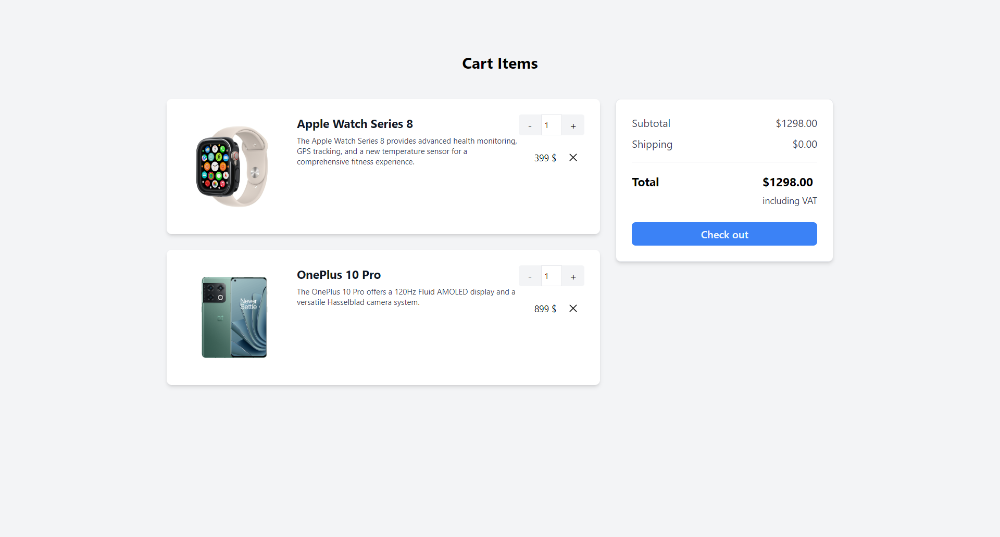
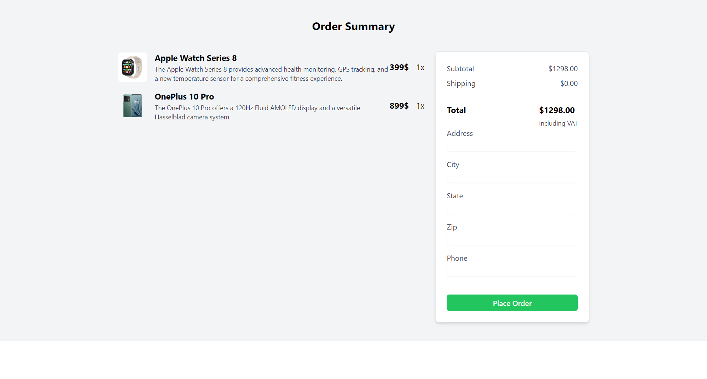
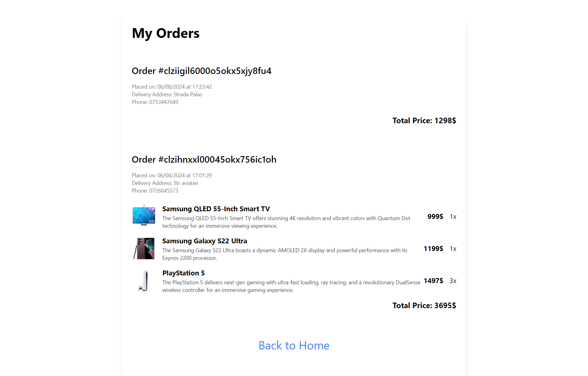
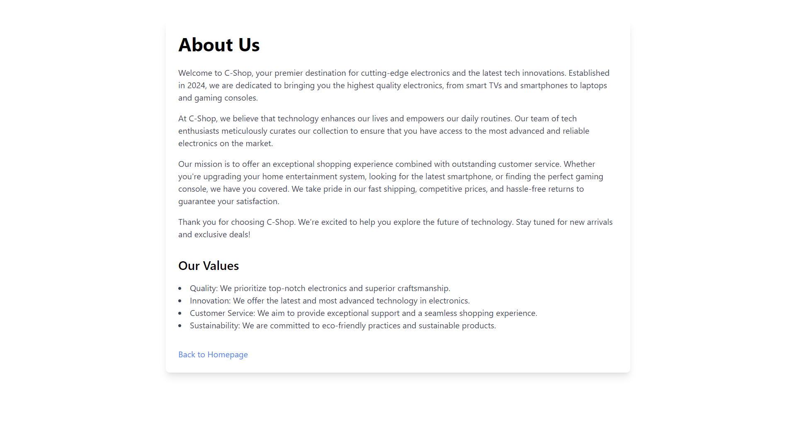
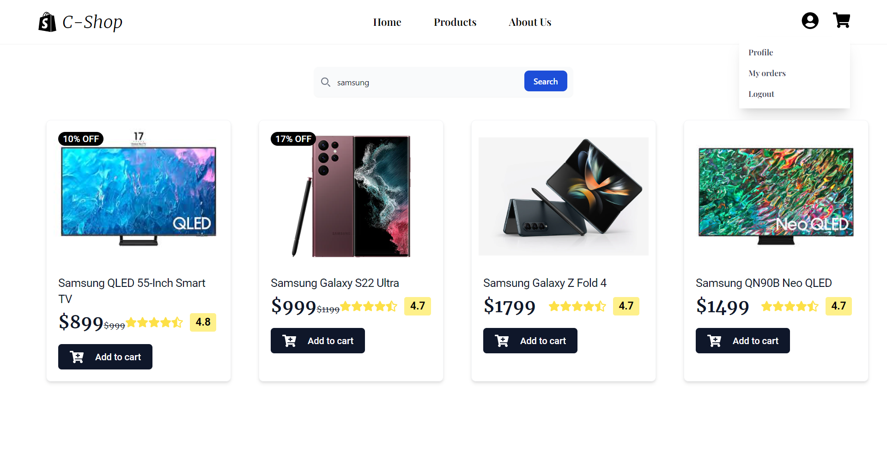

Welcome to the Electronics C-Shop Website! This project is a fully functional online store specializing in electronics. The backend is built with Node.js and Express, while the frontend utilizes React with Vite and Tailwind CSS. TypeScript is used for type safety across both frontend and backend. The project uses PostgreSQL for the database with Prisma ORM for data management.

## Features
- **Product Catalog**: Browse and search through various electronics categories including smart TVs, smartphones, smartwatches, laptops, and gaming consoles.
- **Product Details**: View detailed information about each product, including images, descriptions, ratings, and prices.
- **Shopping Cart**: Add products to the cart and proceed to checkout.
- **User Authentication**: Secure user authentication for logging in and managing orders.
- **Order Management**: Users can view their order history and details.

  
## Features I'm Working On
- **Responsive Design**: Tailwind CSS ensures a responsive and modern design across different devices and screen sizes.
- **Email Service**: Integration with an email service provider to enable functionalities such as order confirmations, password resets, and promotional emails.
- **Review System**: A feature that allows users to leave reviews and ratings for products, providing valuable feedback and insights for future customers.
- **Wishlist System**: Users can create and manage a wishlist of their favorite products, making it easier to keep track of items they wish to purchase in the future.
- **Better Design**: Ongoing improvements to the user interface and experience, including enhanced visual elements, better navigation, and more intuitive layouts to provide an optimal shopping experience.
- **Tests are outdated**
  
## Tech Stack
- **Frontend**:
  - React
  - Vite
  - Tailwind CSS
  - TypeScript
- **Backend**:
  - Node.js
  - Express
  - TypeScript
- **Testing**:
  - Jest
  - Supertest
- **Database**:
  - PostgreSQL
  - Prisma ORM
## Installation

Follow these steps to set up and run the project locally:

- **Install Backend Dependencies**: Run `npm install` in the `backend` directory.
- **Install Frontend Dependencies**: Run `npm install` in the `frontend` directory.
- **Seed the Database**: The seed file is located at `src/utils/seed.ts`. Run `npx ts-node src/utils/seed.ts` to populate the database with initial data.

## Screenshots

### Homepage

### Product Page

### SignUp Page

### Login Page

### Profile Page

### Cart Page

### Order Page

### MyOrders Page

### AboutUs Page

### Using Searchbar Page

